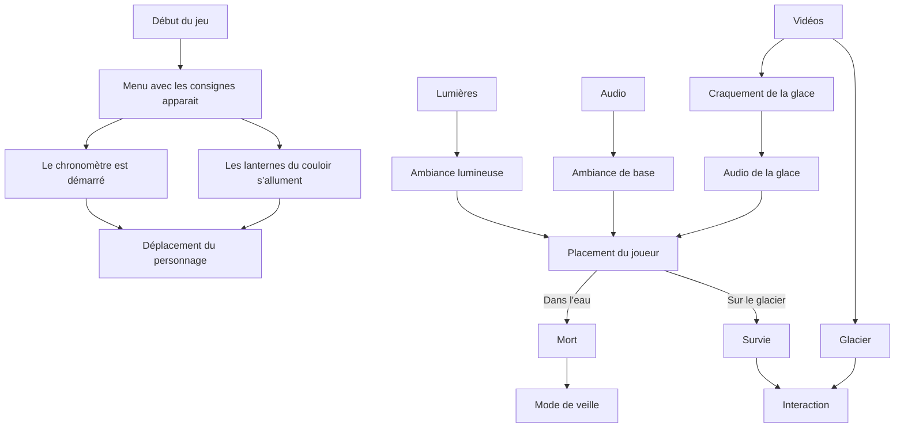

# Mystimix

### Projet de VR par Audrey Dandurand, Camilia Bouatmani, Ihab Mouhajer et Prethiah Rajaratnam
---

Mystimix offre une expérience interactive et immersive plongeant les joueurs dans la peau d'un magicien qui doit élaborer des recettes de sorts en combinant divers ingrédients et en explorant les mystères de la magie.

## La proposition
---
Le magicien se rend dans son sanctuaire et commence à explorer la pièce. Un livre flottant et un chaudron sont posés sur un bureau situé au centre de la pièce. Une zone délimitée autour de la table permet de désactiver le flottement du livre. Simultanément, un menu apparaît dans le livre, contenant les différents ingrédients qu'il peut utiliser, lesquels produisent des résultats différents à chaque fois qu’une recette est terminée. Le magicien doit se déplacer dans la pièce pour cueillir les ingrédients nécessaires à la réalisation de la recette demandée. Un chronomètre évalue la performance du magicien, l'encourageant ainsi à compléter les trois recettes dans le temps le plus court possible.

## Moodboard visuel
---

## Moodboard sonore
---

<iframe width="560" height="315" src="https://www.youtube.com/embed/h1Dd3F5EBJY" title="YouTube video player" frameborder="0" allow="accelerometer; autoplay; clipboard-write; encrypted-media; gyroscope; picture-in-picture" referrerpolicy="strict-origin-when-cross-origin" allowfullscreen></iframe>

<iframe width="560" height="315" src="https://www.youtube.com/embed/K3Q4F8sWBBY" title="YouTube video player" frameborder="0" allow="accelerometer; autoplay; clipboard-write; encrypted-media; gyroscope; picture-in-picture" referrerpolicy="strict-origin-when-cross-origin" allowfullscreen></iframe>

<iframe width="560" height="315" src="https://www.youtube.com/embed/f_5BxlzgkDo" title="YouTube video player" frameborder="0" allow="accelerometer; autoplay; clipboard-write; encrypted-media; gyroscope; picture-in-picture" referrerpolicy="strict-origin-when-cross-origin" allowfullscreen></iframe>

<iframe width="560" height="315" src="https://www.youtube.com/embed/hKjD8whqeK0" title="YouTube video player" frameborder="0" allow="accelerometer; autoplay; clipboard-write; encrypted-media; gyroscope; picture-in-picture" referrerpolicy="strict-origin-when-cross-origin" allowfullscreen></iframe>

<iframe width="560" height="315" src="https://www.youtube.com/embed/Ppi5T6TxUSU" title="YouTube video player" frameborder="0" allow="accelerometer; autoplay; clipboard-write; encrypted-media; gyroscope; picture-in-picture" referrerpolicy="strict-origin-when-cross-origin" allowfullscreen></iframe>

## L'environnement virtuel

## Schéma de programmation

